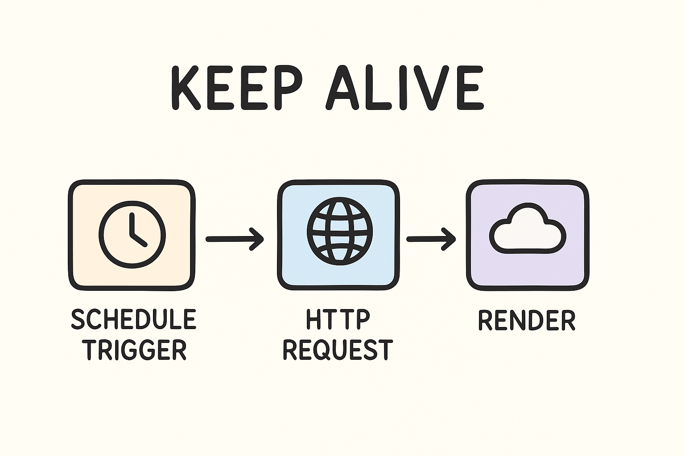

# 🚀 Déployer n8n sur Render (Guide facile & illustré)

[](https://render.com/deploy)

---

## 📌 Qu’est-ce que c’est ?
**n8n** = un outil d’automatisation (comme Zapier, mais gratuit et open-source).  
Avec ce projet, tu l’installes **gratuitement sur Render**.  

👉 Deux modes :  
- **SQLite (par défaut)** → fonctionne direct, mais pas durable (les données disparaissent si Render redémarre).  
- **PostgreSQL Neon (optionnel)** → gratuit (0,5 Go), tes données restent même après un redémarrage.  

---

## 🗺️ Vue d’ensemble
Voici le “parcours” :  

```
[Deploy sur Render] → [Configurer domaine] → [Activer DB Neon (optionnel)] → [Créer Workflow Keep Alive]
```

---

## ⚡ Étape 1 : Installer n8n
1. Clique sur le bouton **Deploy to Render** ci-dessus.  
2. Connecte-toi avec GitHub.  
3. Donne un **nom** à ton service (ex: `n8n`).  
4. Clique **Deploy Blueprint**.  
5. Attends quelques minutes → ton n8n est en ligne 🎉  

---

## 🌍 Étape 2 : Configurer ton domaine Render
Pour que tes webhooks fonctionnent :  

1. Va dans Render → **Dashboard → ton service → Environment**.  
2. Vérifie/ajoute :  
   ```
   N8N_HOST = ton-adresse-render.com
   N8N_PROTOCOL = https
   N8N_PORT = 5678
   WEBHOOK = ton-adresse-render.com
   ```  
3. Sauvegarde → Render redémarre ton service.  

👉 Exemple d’URL webhook généré :  
```
https://ton-adresse-render.com/webhook/1234
```

---

## 💾 Étape 3 (optionnel) : Garder tes données (PostgreSQL Neon)
⚠️ Avec SQLite = données temporaires. Pour garder tes workflows :  

1. Crée un compte gratuit 👉 [neon.tech](https://neon.tech).  
2. Crée un **nouveau projet** (ex: `n8n-db`).  
3. Clique sur **Connect to your database** → flèche ▼ → choisis **Parameters only**.  
4. Clique sur **Hide password** pour afficher ton mot de passe.  
5. Copie tes paramètres (Host, Database, User, Password).  
6. Dans Render → **Dashboard → Environment**, ajoute :  

   ```
   DB_TYPE=postgresdb
   DB_POSTGRESDB_HOST=exemple.neon.tech
   DB_POSTGRESDB_DATABASE=neon-db
   DB_POSTGRESDB_USER=neon-user
   DB_POSTGRESDB_PASSWORD=motdepasse
   ```

👉 Résultat : tes données sont sauvegardées même après redémarrage.

---

## 🔄 Étape 4 : Garder n8n éveillé (anti-sleep mode)
Par défaut, Render “endort” les services gratuits → ton n8n peut s’arrêter.  
👉 Solution : un **workflow Keep Alive** qui “ping” Render toutes les 10 minutes.  

1. Dans n8n → clique **Create workflow**.  
2. Colle ce code JSON :  

```json
{
  "name": "Keep Alive",
  "nodes": [
    {
      "parameters": {
        "rule": {
          "interval": [{ "field": "minutes", "minutesInterval": 10 }]
        }
      },
      "type": "n8n-nodes-base.scheduleTrigger",
      "typeVersion": 1.2,
      "position": [-224, -16],
      "name": "Schedule Trigger"
    },
    {
      "parameters": {
        "url": "https://ton-adresse-render.com/healthz",
        "options": {}
      },
      "type": "n8n-nodes-base.httpRequest",
      "typeVersion": 4.2,
      "position": [16, -16],
      "name": "HTTP Request"
    }
  ],
  "connections": {
    "Schedule Trigger": {
      "main": [[{ "node": "HTTP Request", "type": "main", "index": 0 }]]
    }
  }
}
```

3. ⚠️ **Important : changer l’URL !**  
   - Double-clique sur le nœud **HTTP Request**.  
   - Remplace `https://ton-adresse-render.com/healthz` par ton **vrai domaine Render**.  

   

4. Clique sur **Save** puis sur le bouton **Active (check vert)**.  

👉 Maintenant ton n8n reste réveillé 24/7 🚀  

---

## 🧹 Étape 5 : Nettoyage automatique (déjà activé)
- Max **100 exécutions par workflow**  
- Max **14 jours de rétention**  
👉 Rien à faire, c’est déjà configuré.  

---

## ✅ Résumé
✔️ Déploiement en 1 clic  
✔️ SQLite = rapide mais temporaire  
✔️ Neon PostgreSQL = persistant et gratuit (0,5 Go)  
✔️ Workflow Keep Alive = reste actif 24/7  

---

👨‍💻 **Créé par Chantelou Ngouanou (Tknodev School Officiel)**  
🙏 Inspiré d’Antoine Deschamps  
